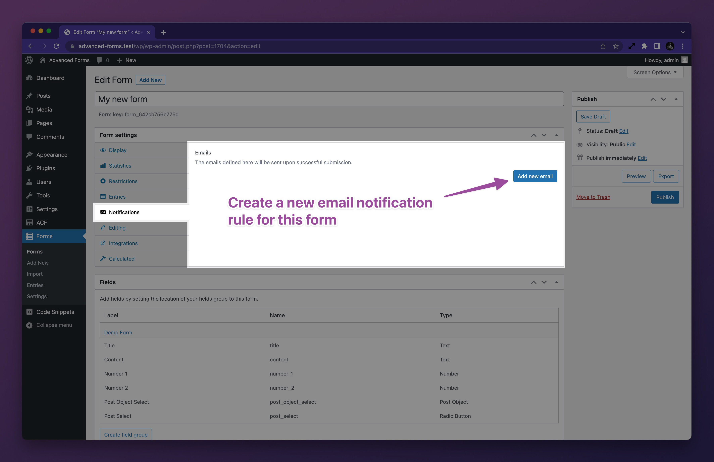
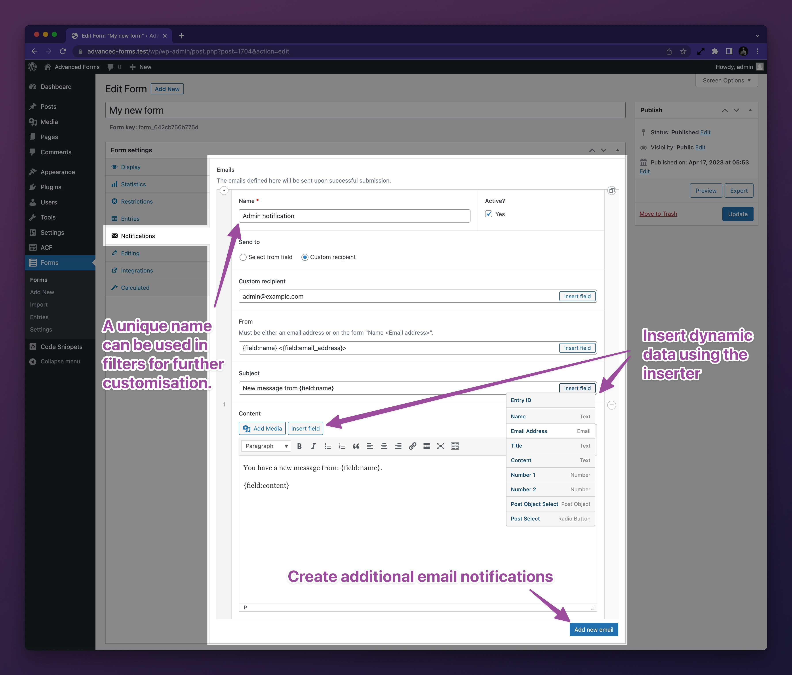
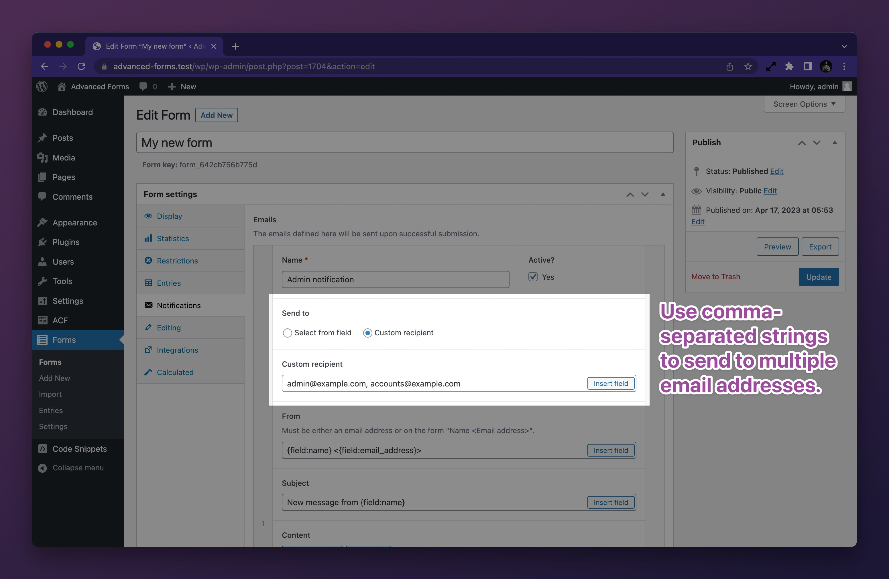

# Configuring notification emails

Advanced Forms' email notification system makes it possible to configure any number of notification emails to any number
of recipients on form submission. Each notification email can be configured to send to a different set of recipients and
each email can be set up to send different fields (or not fields at all) from the submission.

## How to configure a notification email

First, navigate to the form you want to configure a notification email for and click the **Notifications** tab under the
**Form Settings** metabox:

Next, click the **Add new email** button to create a new notification email and populate the available fields:

Finally, click the **Update** button in the top right corner of the page to save your form settings.

## How to send a notification emails to multiple recipients

To send a notification email to multiple recipients, simply separate the email addresses with a comma:

## Related links

- [Customizing email notifications](Customizing-email-notifications.md)
- [How to add the current page title to an email notification](How-to-add-the-current-page-title-to-an-email-notification.md)