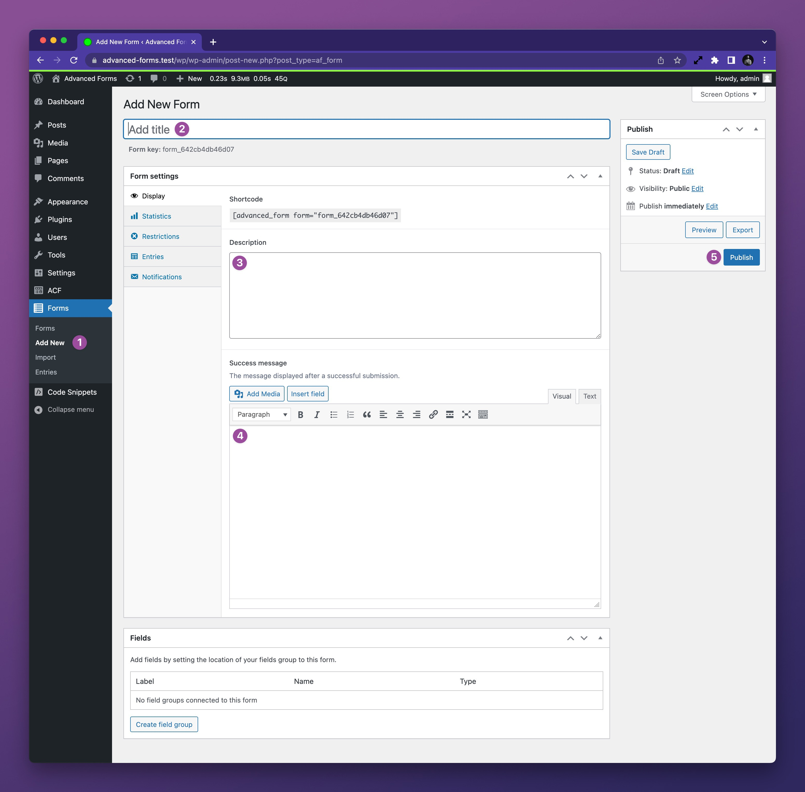
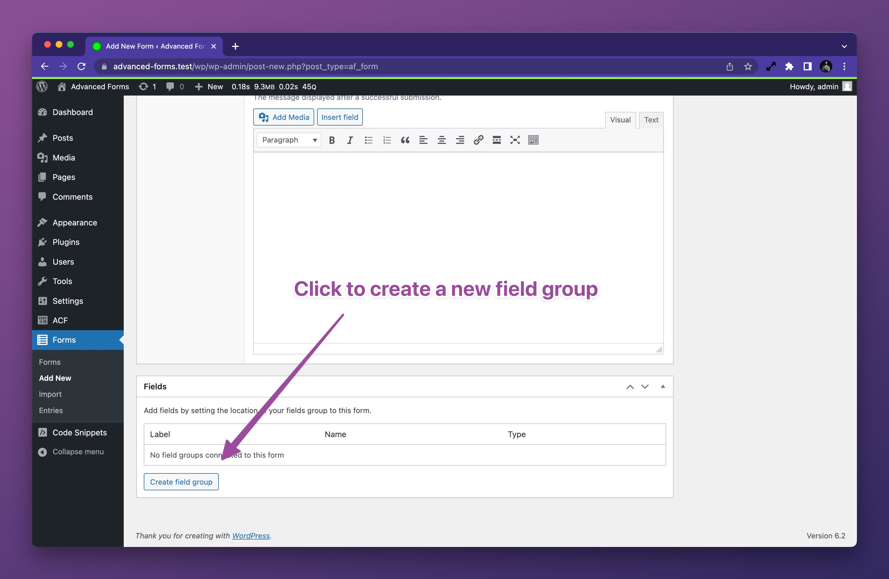
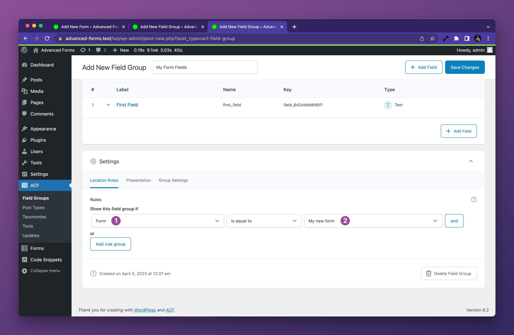
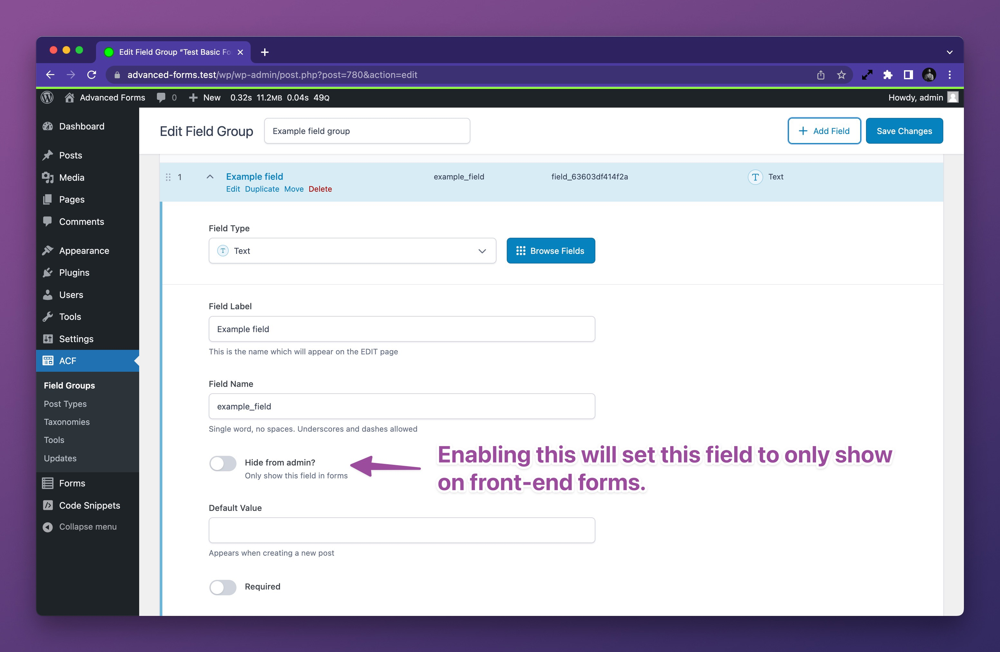

# Creating a form

Creating a form is as simple as creating a new post in WordPress, then setting the form as the location for one or more
field groups.

## To create a new form

1. Navigate to the WordPress admin and under the **Forms** menu, click **Add New**.
2. Enter a name for the form.
3. Optionally enter a description for the form.
4. If you wish to show a success message after the form is submitted, enter the message in the **Success message**
   field.
5. Click the blue **Publish** button to save the form.

## Configuring a field group to render on the form

At this point, you have an empty form with no fields. To add fields to the form, you need to set the form as the
location for one or more field groups.

### Creating a new field group for the form

You may create ACF field groups as you normally would using the **ACF > Field Groups** screen. However, you can also
create a new field group directly from the form edit screen using the **Create field group** button in the **Fields**
metabox:

### Connecting an existing field group to the form

Once you have a field group created, you can set it to render on the form by selecting **Advanced Forms > Form** in the
field group's **Location Rules** settings and then selecting the form from the resulting list:

## Setting fields to appear in forms only

If you are using a field group on both a form and another location in the WordPress admin, you may wish to hide some
fields that are intended for the form only. To do so, you may use the **Hide from admin** setting added to fields in the
field group edit screen:

