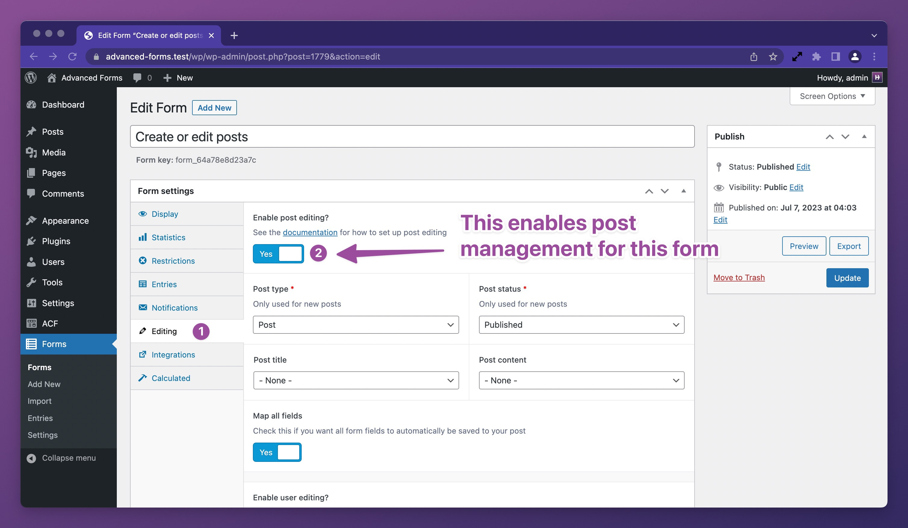
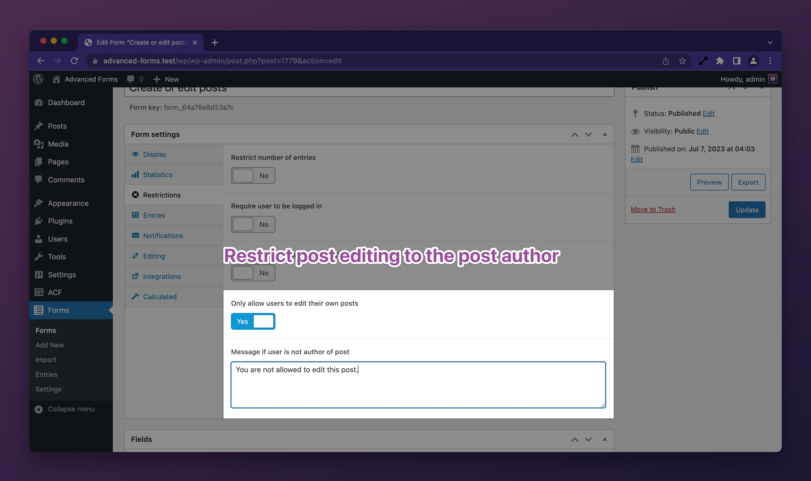

# Creating and editing posts

<div class="htdocs-pro-feature-callout" data-plugin="afp"></div>

A very common use case for ACF forms on the front end is to allow users to create and edit posts. Some examples of this
include:

1. User submitted blog posts
2. Allowing users a single page to act as their profile
3. Bespoke support ticket system where users can submit ticket posts
4. A front end job board where users can submit job posts
5. A front end directory where users can submit directory posts
6. A real-estate listing site where users can submit property posts
7. User reviews or products or services that are then displayed on the site

Advanced Forms Pro makes this very easy to do and with a comprehensive set of actions and filters available, you can
customize the post creation and editing process to suit almost any scenario – the possibilties are endless.

## Configuring a form to work with posts

To create or edit posts with a form, you need to enable post editing in the form's settings. Once you have [created a
form and assigned one or more field groups to it](Creating-a-form.md), go to the form's settings and enable post
editing:



Once you have enabled post editing, you will see a new section appear under the toggle. This section allows you to
choose which post type and post status posts will be created with.

### Controlling the post title and content

You may also configure the post title and post content. This can be done either with a fixed (custom) value, the value
of an ACF field attached to this form, or a combination of both.


Be mindful that if you haven't set this form in at least
one [field group's location rules](Creating-a-form.md#configuring-a-field-group-to-render-on-the-form), no fields will
be available for selection here.

### Controlling which submitted fields are stored on the affected post

By default, all ACF fields on the form will be saved against the affected post. If you have set up some fields
specifically for core object properties such as the post title, post content, post status, etc, you may choose to
prevent Advanced Forms from saving the values as ACF field metadata on the post. This can be done by disabling the **Map
all fields** option and explicitly choosing the fields you want to save as ACF field metadata.


If you have fields that are only intended for front end submission and the field group is also used in the WordPress
admin, you may prevent these fields from rendering in the WordPress admin. This can be done in the individual field
settings panel within a field group edit screen.


### Modifying the post data before post creation or update

Whilst Advanced Forms Pro has a small set of UI-based controls, you may control any property of the post object being
created or edited by using the `af/form/editing/post_data` filter. This filter is passed the post data array, the form
array, and the form render args array. For example;

```php
add_filter( 'af/form/editing/post_data', function ( $post_data, $form, $args ) {
	// Override post title
	$post_data['post_title'] = 'New post title!';

	// Conditionally control the post status
	if ( current_user_can( 'administrator' ) ) {
		$post_data['post_status'] = 'publish';
	} else {
		$post_data['post_status'] = 'draft';
	}
	
	// Set the excerpt using a submitted value
	$post_data['post_excerpt'] = esc_html( af_get_field('excerpt') );

	return $post_data;
}, 10, 3 );
```

For a full list of post data attributes, see
the [wp_insert_post() function docs](https://developer.wordpress.org/reference/functions/wp_insert_post/).

For more specific examples leveraging the filter, see the [Related docs](#related-docs) section below.

### How to access the affected post ID

When a post is created or updated, Advanced Forms will store the post ID on the submission object under the `post`
attribute for further use. This means you can access the newly created (or updated) post ID in any actions or filters
that run after the post has been affected – this allows you to do anything you like using PHP with the post. Consider
the following example which demonstrates using the post ID in
a [custom submission handler](Processing-form-submissions.md):

```php
add_action( 'af/form/submission', function ( $form, $fields, $args ) {
	// Restrict to a specific form
	if( $form['key'] !== 'form_62bd15508b9c9' ){
		return;
	}

	if ( isset( AF()->submission['post'] ) ) {
		$post_id = AF()->submission['post'];
		
		// Use the post ID here…
	}
}, 20, 3 ); // Note the priority of 20 here. Core post editing/creation actions run at priority 10.
```

There's no need to worry about field name conflicts either. Advanced Forms stores the submitted field values sensibly so
that if you happen to also have a field with the name `post`, there won't be any conflicts.

## Creating new posts

Creating new posts is the default behaviour when a form has post editing enabled. This means that you can put a form
anywhere you need it and it will reliably serve as a post creation form. The main difference between creating and
editing posts is that to edit a post, an advanced form needs to know which post to edit. This context is provided
through the use of render arguments and without explicit instruction, Advanced Forms does not infer a post context. This
provides a lot of flexibility. To use a form to edit an existing post,
see [Editing existing posts](#editing-existing-posts).

### Running custom actions after a post is created

After a post is created, the `af/form/editing/post_created` action is fired. You may use this action to run any custom
functionality that is specific to new posts. For example;

```php
add_action( 'af/form/editing/post_created', function ( $post, $form, $args ) {
	// Restrict to a specific form
	if( $form['key'] !== 'form_62bd15508b9c9' ){
		return;
	}
	
	$post_id = $post->ID;
	// Do something with the post ID here…
	
}, 10, 3 );
```

## Editing existing posts

To edit an existing post, you must provide a post ID to the form. This is provided through the `post` form arg. Setting
this arg tells Advanced Forms Pro that the form submission is an update request and specifies which post to target. This
can be provided both in the shortcode and the `advanced_form()` function. It can also be set if using the **Advanced
Form** block in the block editor.

### Editing the current post

If you wish to edit the current post, you can place a form on the single post screen and set the `post` arg
to `current`.

When using the shortcode, this would look like:

`[[advanced_form form="form_62bd15508b9c9" post="current"]]`

When using the `advanced_form()` function, this would look like:

```php
advanced_form( 'form_62bd15508b9c9', [ 'post' => 'current' ] );
```

When using the **Advanced Form** block, you can choose the **Edit current post** option in the block's settings under
the **Editing** tab.

When set to `current`, Advanced Forms will make a call to
WordPress' [get_the_ID() function](https://developer.wordpress.org/reference/functions/get_the_id/) so this relies on
WordPress having set up the global post object.

### Editing a post by ID

If you know exactly which post you want to edit, you can set the `post` arg to the post ID. For example:

`[[advanced_form form="form_62bd15508b9c9" post="123"]]`

When using the `advanced_form()` function, this would look like:

```php
advanced_form( 'form_62bd15508b9c9', [ 'post' => 123 ] );
```

When using the **Advanced Form** block, you can choose the **Edit specific post** option and choose the desired post in
the block's settings under the **Editing** tab.

### Editing a post by URL query parameter

You may also instruct the form to extract the post ID from the `post` URL query parameter. This is useful if you want to
provide links to a page specifically for editing posts. To enable this behaviour, set the `post` arg to `param`.

<div class="htdocs-warning">
	<h4>Important:</h4>
	<p>It is recommended that you restrict post editing to the post author only to prevent users editing posts they 
don't own. See [Restrict editing to the post author only](#restrict-editing-to-the-post-author-only).</p>
</div>

For example:

`[[advanced_form form="form_62bd15508b9c9" post="param"]]`

When using the `advanced_form()` function, this would look like:

```php
advanced_form( 'form_62bd15508b9c9', [ 'post' => 'param' ] );
```

When using the **Advanced Form** block, you can choose the **Edit post from query parameter** option in the block's
settings under the **Editing** tab.

When set to `param`, Advanced Forms will look for a URL query parameter with the name `post` and use the value assigned
to that parameter. e.g; `https://example.com/edit-post/?post=123`

#### Customizing the URL query parameter name

If you wish to use a different URL query parameter name, you may use the `af/form/editing/query_param` filter as
follows:

```php
add_filter( 'af/form/editing/query_param', function ( $param, $form, $args ) {
	// Restrict to a specific form
	if( $form['key'] !== 'form_62bd15508b9c9' ){
		return $param;
	}
	
	// Set the custom parameter name
	return 'my_custom_param';
}, 10, 3 );
```

### Restrict editing to the post author only

By default, Advanced Forms allows any user to edit any post. You may restrict this behaviour so that only the post
author may edit their own posts. To do this, enable the **Only allow users to edit their own posts** option in the
form's **Restrictions** settings:



This will prevent everyone (admins included) from editing posts that they did not create. For more granular control,
see [Applying custom restrictions to a form](Applying-custom-restrictions-to-a-form.md).

## Customizations (should these perhaps go in separate docs?)

### How to customise the post author

### How to set the post excerpt when creating or editing a post https://hookturn.freshdesk.com/a/solutions/articles/4400242

### How to set the newly created user as author of a newly created post https://hookturn.freshdesk.com/a/solutions/articles/44002348398 Need to test this one as it may already be the case.

### How to prevent emails sending if form is updating a post https://hookturn.freshdesk.com/a/solutions/articles/44002348396

### How to remove emojis from created post titles https://hookturn.freshdesk.com/a/solutions/articles/44002348426

### How to assign taxonomy terms to posts https://hookturn.freshdesk.com/a/solutions/articles/44002378265

## Related docs

- [How to add a post status select field to a form that creates posts](How-to-add-a-post-status-select-field-to-a-form-that-creates-posts.md)
- [How to dynamically change a success message when a post is updated](How-to-dynamically-change-a-success-message-when-a-post-is-updated.md)
- [How to change a users role on post creation](How-to-change-a-users-role-on-post-creation.md)
- [How to redirect the form submission after post creation](How-to-redirect-the-form-submission-after-post-creation.md)
- [How to create multiple posts with a single form submission](How-to-create-multiple-posts-with-a-single-form-submission.md)