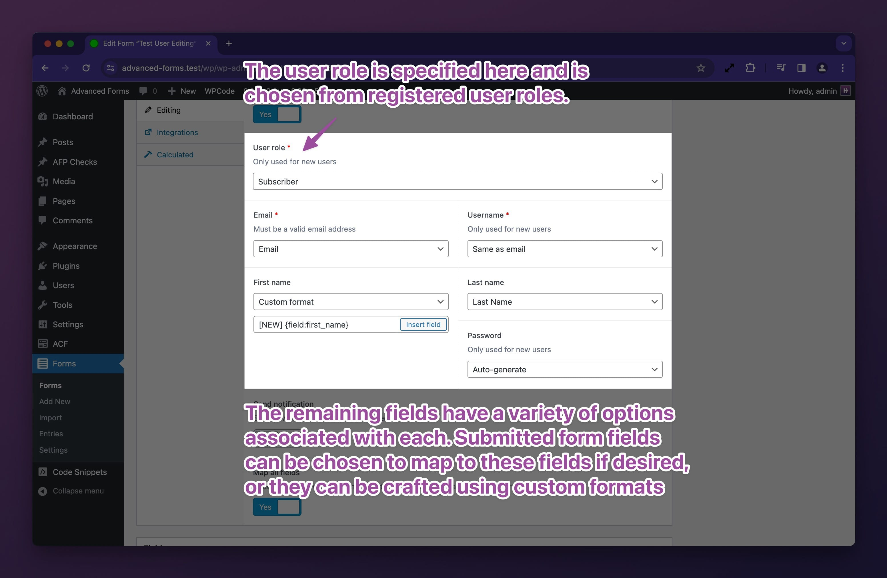

# Creating and editing users

[htdocs_pro_feature_callout plugin="afp"]

Creating and editing users directly from the front end of your WordPress site can be a powerful feature. This
functionality can be used in various scenarios, such as:

- Allowing users to manage their own profiles.
- Creating custom user registration forms.
- Building a membership site where users can sign up and maintain their accounts.
- Implementing a custom user management system for specific roles or capabilities.

Advanced Forms Pro for ACF makes the process of managing user data from the front end straightforward and highly
flexible. With a wide range of actions and filters, you can tailor the user creation and editing process to fit nearly
any requirement.

## Configuring a form to work with users

To enable user creation or editing, first, configure your form to manage user data. This involves setting up your form
to interact with WordPress's user data structure.


Once you have enabled user editing, you will see a new section appear under the toggle. This section allows you to
choose the user role and assign form fields to core user fields.

### Controlling core user fields

In your form, you can control core user fields such as email, username, first name, last name, and password.



### Controlling which submitted fields are stored on the affected user

By default, all ACF fields on the form will be saved against the affected user. If you have set up some fields
specifically for core user fields such as the first name, email, etc, you may choose to prevent Advanced Forms from
saving the values as ACF field metadata on the user as this would only be duplicate data. This can be done by disabling
the **Map all fields** option and explicitly choosing the fields you want to save as ACF field metadata.


If you have fields that are only intended for front end submission and the field group is also used in the WordPress
admin, you may prevent these fields from rendering in the WordPress admin. This can be done in the individual field
settings panel within a field group edit screen.


### Modifying the user data before user creation or update

Whilst Advanced Forms Pro has a small set of UI-based controls, you may control any property of the user object being
created or edited by using the `af/form/editing/user_data` filter. This filter is passed the user data array, the form
array, and the form render args array. For example;

```php
add_filter( 'af/form/editing/user_data', function ( $user_data, $form, $args ) {
	// Restrict to a specific form
	if( $form['key'] !== 'form_62bd15508b9c9' ){
		return $user_data;
	}
	
	// Override the email address
	$user_data['user_email'] = 'user@example.com';
	
	// Set the nickname using a submitted value
	$user_data['nickname'] = esc_html( af_get_field( 'preferred_name' ) );

	return $user_data;
}, 10, 3 );
```

For a full list of user data attributes, see
the [wp_insert_user() function docs](https://developer.wordpress.org/reference/functions/wp_insert_user/).

For more specific examples leveraging the filter, see the [Related docs](#related-docs) section below.

### How to access the affected user ID

When a user is created or updated, Advanced Forms will store the user ID on the submission object under the `user`
attribute for further use. This means you can access the newly created (or updated) user ID in any actions or filters
that run after the user has been affected – this allows you to do anything you like using PHP with the user. Consider
the following example which demonstrates using the user ID in
a [custom submission handler](Processing-form-submissions.md):

```php
add_action( 'af/form/submission', function ( $form, $fields, $args ) {
	// Restrict to a specific form
	if( $form['key'] !== 'form_62bd15508b9c9' ){
		return;
	}

	if ( isset( AF()->submission['user'] ) ) {
		$user_id = AF()->submission['user'];
		
		// Use the user ID here…
	}
}, 20, 3 ); // Note the priority of 20 here. Core user editing/creation actions run at priority 10.
```

There's no need to worry about field name conflicts either. Advanced Forms stores the submitted field values sensibly so
that if you happen to also have a field with the name `user`, there won't be any conflicts.

## Creating new users

Creating new users is the default behaviour when a form has user editing enabled. This means that you can put a form
anywhere you need it and it will reliably serve as a user creation form. The main difference between creating and
editing users is that to edit a user, an advanced form needs to know which user to edit. This context is provided
through the use of render arguments and without explicit instruction, Advanced Forms does not infer a user context. This
provides a lot of flexibility. To use a form to edit an existing user,
see [Editing existing users](#editing-existing-users).

### Running custom code after user creation

After a user is created, the `af/form/editing/user_created` action is fired. You may use this action to run any custom
functionality that is specific to new users. For example;

```php
add_action( 'af/form/editing/user_created', function ( $user, $form, $args ) {
	// Restrict to a specific form
	if( $form['key'] !== 'form_62bd15508b9c9' ){
		return;
	}
	
	$user_id = $user->ID;
	
	// Do something with the user ID here…
	
}, 10, 3 );
```

## Editing existing users

To edit an existing user, you must specify which user to target using the `user` form arg. Setting this arg gives
Advanced Forms Pro context and indicates that the form is intended for editing an existing user. If the plugin can find
the user, it will preload the values into the form for editing.

The user context can be passed to both the shortcode and the `advanced_form()` function. It can also be set if using
the **Advanced Form** block in the block editor.

### Editing the current user

If you wish to edit the current logged in user, you can set the `user` arg to `current`.

When using the shortcode, this would look like:

```php
[[advanced_form form="form_62bd15508b9c9" user="current"]]
```

When using the `advanced_form()` function, this would look like:

```php
advanced_form( 'form_62bd15508b9c9', [ 'user' => 'current' ] );
```

When using the **Advanced Form** block, you can choose the **Edit current user** option in the block's settings under
the **Editing** tab.

When set to `current`, Advanced Forms will make a call to
WordPress' [get_current_user_id() function](https://developer.wordpress.org/reference/functions/get_current_user_id/) so
this relies on WordPress having a logged in user.

### Editing a user by ID

If you know exactly which user you want to edit, you can set the `user` arg to the user ID. For example:

```php
[[advanced_form form="form_62bd15508b9c9" user="123"]]
```

When using the `advanced_form()` function, this would look like:

```php
advanced_form( 'form_62bd15508b9c9', [ 'user' => 123 ] );
```

When using the **Advanced Form** block, you can choose the **Edit specific user** option and choose the desired user in
the block's settings under the **Editing** tab.

### Editing a user by URL query parameter

There isn't currently a setting in the UI to edit a user by URL query parameter, but you can do this programmatically
using the `af/form/args` filter. For example:

```php
add_filter( 'af/form/args', function ( $args, $form ) {
	// Restrict to a specific form
	if( $form['key'] !== 'form_62bd15508b9c9' ){
		return $args;
	}
	
	// Get the user ID from the URL
	$user_id = absint( $_GET['my_user_id'] ?? null );
	
	// Set the user ID as the user arg
	if( $user_id ){
		$args['user'] = $user_id;
	}
	
	return $args;
}, 20, 2 ); // Note the priority of 20 here. Core user arg evaluation runs at priority 10.
```

The above example would allow you to edit a user by passing a URL query parameter such
as `https://example.com/edit-user?my_user_id=123`.

### Running custom code after user is updated

After an existing user is updated, the `af/form/editing/user_updated` action is fired. You may use this action to run
any custom functionality that is specific to new users. For example;

```php
add_action( 'af/form/editing/user_updated', function ( $user, $form, $args ) {
	// Restrict to a specific form
	if( $form['key'] !== 'form_62bd15508b9c9' ){
		return;
	}
	
	$user_id = $user->ID;
	
	// Do something with the user ID here…
	
}, 10, 3 );
```

## Related docs

- [How to redirect the form submission after user creation](How-to-redirect-the-form-submission-after-user-creation.md)
- [How to change a users role on user creation](How-to-change-a-users-role-on-user-creation.md)
- [How to change a users role on post creation](How-to-change-a-users-role-on-post-creation.md)
- [How to update a user's password from a form field](How-to-update-a-users-password-from-a-form-field.md)
- [How to create multiple users with a single form submission](How-to-create-multiple-users-with-a-single-form-submission.md)
- [How to use URL parameters to switch between creating and editing users](How-to-use-URL-parameters-to-switch-between-creating-and-editing-users.md)
