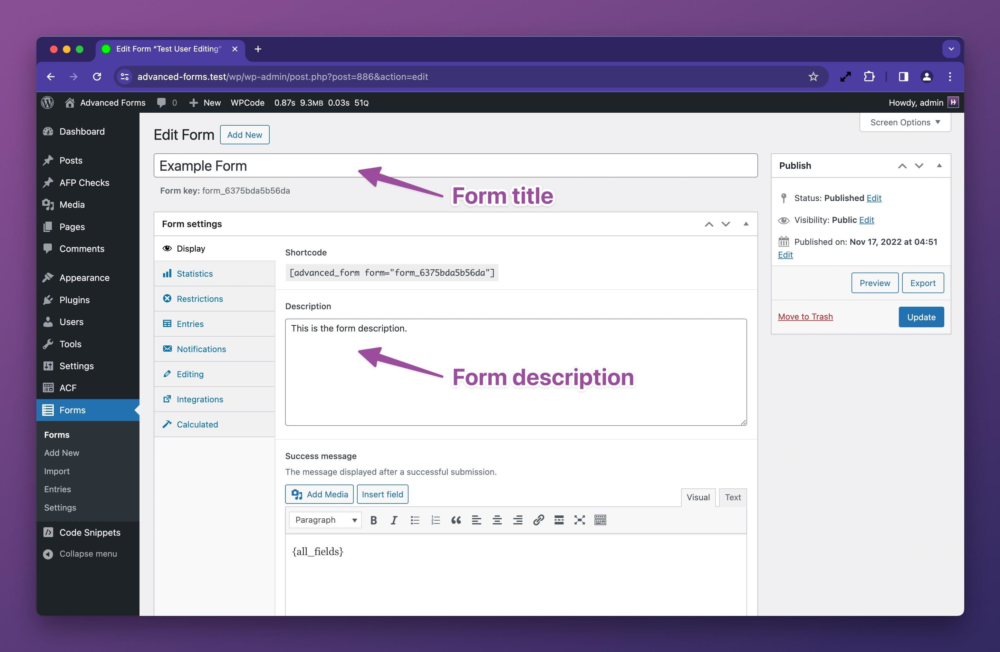
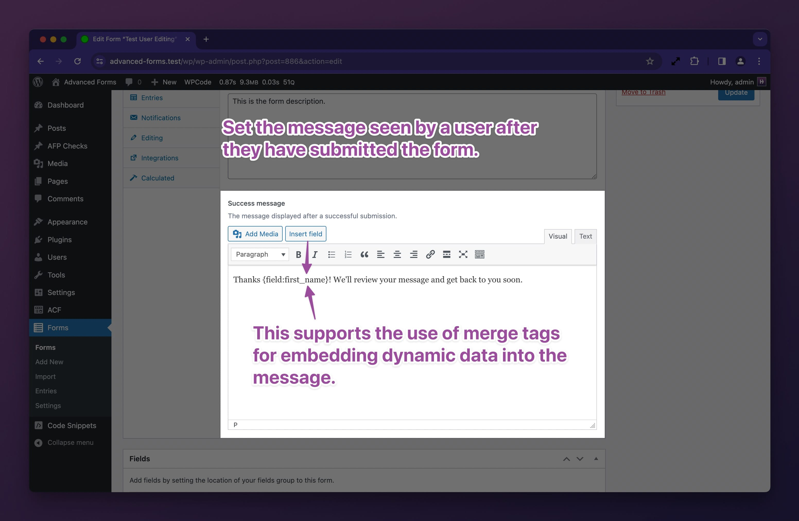

# Customizing how the form renders

Advanced Forms offers a vast array of options, hooks, and filters for customizing how a form renders.

During development, if you need a quick visual reference for where action hooks sit within a form, you may use the
following snippet. This will render markup on the front end that shows the name of each hook as it is fired during form
render so be sure to use this in an environment that is not publicly accessible:

```php
$show_hooks = [
	'af/form/enqueue',
	'af/form/before_title',
	'af/form/after',
	'af/form/before_field_wrapper',
	'af/form/before_fields',
	'af/form/hidden_fields',
	'af/field_group/before_field_group',
	'af/field/before_field',
	'af/field/after_field',
	'af/field_group/after_field_group',
	'af/form/after_fields',
	'af/form/after_field_wrapper',
];
foreach ( $show_hooks as $hook ) {
	add_action( $hook, function () use ( $hook ) {
		echo '<p style="background: #0a4b78; color: white; padding: 4px 8px; font-size: 14px; margin-block: 1px;">' . $hook . '</p>';
	}, 10, 2 );
}
```

## Excluding fields from the form

You may wish to exclude certain fields from the form. This can be done using
the [`exclude_fields` display argument](Display-arguments.md#exclude_fields).

If you wish to do so using PHP, you may use the `af/form/args` filter to modify the display args:

```php
add_filter( 'af/form/args', function( $args, $form ) {
	// Restrict to a specific form
	if( $form['key'] !== 'form_62bd15508b9c9' ){
		return $args;
	}
	
	// Set the fields to exclude on form render
	$args['exclude_fields'] = [
		'my_field',
		'my_second_field',
		'field_5f5b2b2b2b2b2', // Exclude a group by its field key
	];

	return $args;
}, 10, 2 );

// You may also use more specific filters to target a form either by its post ID or form key
add_filter( "af/form/args/id=$form_id", ... );
add_filter( "af/form/args/key=$form_key", ... );
```

## Excluding sub fields

Sub fields, such as those within groups, repeaters, or flexible content fields, are not currently evaluated for
exclusion. This is a known limitation that will be addressed in a future release. For now, there is a workaround which
is available in our support documents:

[How to exclude sub fields from rendering in a form](https://hookturn.freshdesk.com/support/solutions/articles/44002397391)

## Reordering & modifying field groups

See [Filtering form field groups](Filtering-form-field-groups.md).

## Controlling the form title and description

### Setting the title and description

You may set the form title and description on the form edit screen as follows:



If you wish to do so using PHP, you may use the `af/form/before_render` filter to modify the form object:

```php
add_filter( 'af/form/before_render', function( $form, $args ) {
	// Restrict to a specific form
	if( $form['key'] !== 'form_62bd15508b9c9' ){
		return;
	}
	
	// Set the title and description
	$form['title'] = 'My custom form title';
	$form['display']['description'] = 'My custom form description message.';
	
	return $form;
}, 10, 2 );

// You may also use more specific filters to target a form either by its post ID or form key
add_filter( "af/form/before_render/id=$form_id", ... );
add_filter( "af/form/before_render/key=$form_key", ... );
```

### Hiding the title and description

When rendering a form, you may toggle the display of the title and description using the
[`display_title` and `display_description` display arguments](Display-arguments.md#display_title).

If you wish to do so using PHP, you may use the `af/form/args` filter to modify the display args:

```php
add_filter( 'af/form/args', function( $args, $form ) {
	// Restrict to a specific form
	if( $form['key'] !== 'form_62bd15508b9c9' ){
		return $args;
	}
	
	// Toggle the title and description off
	$args['display_title'] = false;
	$args['display_description'] = false;

	return $args;
}, 10, 2 );

// You may also use more specific filters to target a form either by its post ID or form key
add_filter( "af/form/args/id=$form_id", ... );
add_filter( "af/form/args/key=$form_key", ... );
```

## Controlling the field instruction placement

You may control where the instructions are rendered on a form using
the [`instruction_placement` display argument](Display-arguments.md#instruction_placement).

If you wish to do so via PHP, you may use the `af/field/instruction_placement` filter:

```php
add_filter( 'af/field/instruction_placement', function( $placement, $field, $form, $args ) {

	// Set either field or label here
	$placement = 'field';

	return $placement;
}, 10, 4 );

// You may also use more specific filters to target a field either by its name or key
add_filter( "af/field/instruction_placement/name=$field_name", ... );
add_filter( "af/field/instruction_placement/key=$field_key", ... );
```

## Customizing the submit button text

You may pass custom submit button text to the [`submit_text` display argument](Display-arguments.md#submit_text) when
displaying a form.

If you wish to do so using PHP, you may use the `af/form/args` filter to modify the display args:

```php
add_filter( 'af/form/args', function( $args, $form ) {
	// Restrict to a specific form
	if( $form['key'] !== 'form_62bd15508b9c9' ){
		return $args;
	}
	
	// Set the submit button text. Simple HTML such as <span> tags will work here.
	$args['submit_text'] = 'Send message';

	return $args;
}, 10, 2 );

// You may also use more specific filters to target a form either by its post ID or form key
add_filter( "af/form/args/id=$form_id", ... );
add_filter( "af/form/args/key=$form_key", ... );
```

## Customizing the form wrapper attributes

If you need to add custom or modify existing HTML attributes to the `<form>` element, you may use
the `af/form/attributes` filter:

```php
add_filter( 'af/form/attributes', function( $attributes, $form, $args ) {
	// Restrict to a specific form
	if( $form['key'] !== 'form_62bd15508b9c9' ){
		return $attributes;
	}
	
	// Set a custom attribute
	$attributes['data-foo'] = 'bar';

	return $attributes;
}, 10, 3 );

// You may also use more specific filters to target a form either by its post ID or form key
add_filter( "af/form/attributes/id=$form_id", ... );
add_filter( "af/form/attributes/key=$form_key", ... );
```

### Add custom CSS classes for CSS styling

Advanced Forms adds the `af-form` class to the form wrapper but you may add additional classes as follows:

```php
add_filter( 'af/form/attributes', function( $attributes, $form, $args ) {
	// Append a custom classs
	$attributes['class'] .= ' my-custom-class';
	
	return $attributes;
}, 10, 3 );
```

## Adding HTML before and after a form

You may render custom markup before and after a form using the `af/form/enqueue` and `af/form/after` filters:

```php
add_filter( 'af/form/enqueue', function( $form, $args ) {
	echo '<div class="my-custom-wrapper">';
}, 10, 2 );

add_filter( 'af/form/after', function( $form, $args ) {
	echo '</div>';
}, 10, 2 );

// You may also use more specific filters to target a form either by its post ID or form key
add_filter( "af/form/enqueue/id=$form_id", ... );
add_filter( "af/form/enqueue/key=$form_key", ... );

add_filter( "af/form/after/id=$form_id", ... );
add_filter( "af/form/after/key=$form_key", ... );
```

## Adding HTML before the form title

If you wish to add custom markup just after the opening `<form>` tag, you may use the `af/form/before_title` filter:

```php
add_filter( 'af/form/before_title', function( $form, $args ) {
	echo '<p>Some custom element</p>';
}, 10, 2 );

// You may also use more specific filters to target a form either by its post ID or form key
add_filter( "af/form/before_title/id=$form_id", ... );
add_filter( "af/form/before_title/key=$form_key", ... );
```

## Adding hidden fields

See [Working with hidden fields](Working-with-hidden-fields.md).

## Adding HTML before and after all form fields

If you wish to add custom markup before and after all form fields, you have two sets of hooks to choose from. The first
option in the `af/form/before_field_wrapper` and `af/form/after_field_wrapper` hooks. These hooks fire once respectively
before and after all the fields have rendered and encompass the submit button row as well:

```php
add_filter( 'af/form/before_field_wrapper', function( $form, $args ) {
	echo '<div class="my-custom-wrapper">';
}, 10, 2 );

add_filter( 'af/form/after_field_wrapper', function( $form, $args ) {
	echo '</div>';
}, 10, 2 );

// You may also use more specific filters to target a form either by its post ID or form key
add_filter( "af/form/before_field_wrapper/id=$form_id", ... );
add_filter( "af/form/before_field_wrapper/key=$form_key", ... );

add_filter( "af/form/after_field_wrapper/id=$form_id", ... );
add_filter( "af/form/after_field_wrapper/key=$form_key", ... );
```

If you wish to add custom markup before and after all the fields but not the submit button row, you may use
the `af/form/before_fields` and `af/form/after_fields` hooks:

```php
add_filter( 'af/form/before_fields', function( $form, $args ) {
	echo '<div class="my-custom-wrapper">';
}, 10, 2 );

add_filter( 'af/form/after_fields', function( $form, $args ) {
	echo '</div>';
}, 10, 2 );

// You may also use more specific filters to target a form either by its post ID or form key
add_filter( "af/form/before_fields/id=$form_id", ... );
add_filter( "af/form/before_fields/key=$form_key", ... );

add_filter( "af/form/after_fields/id=$form_id", ... );
add_filter( "af/form/after_fields/key=$form_key", ... );
```

## Adding HTML before and after field groups

A an Advanced Forms form can contain multiple field groups. If you wish to add custom markup before and after each field
group, you may use the `af/field_group/before_field_group` and `af/field_group/after_field_group` hooks.

Note that these hooks don't yet have specific variations so it is necessary to check for a specific form or field group
for controlling when the markup should render.

[htdocs_highlight]

**Important:**

These hooks offer a lot of flexibility but modifying the markup may negatively affect the JavaScript that manages
multi-stage forms. Be mindful of this when using these hooks.

[/htdocs_highlight]

```php
add_filter( 'af/field_group/before_field_group', function( $field_group, $form, $args ) {
	// Restrict to a specific form
	if( $form['key'] !== 'form_62bd15508b9c9' ){
		return;
	}
	echo '<div class="my-custom-field-group-wrapper">';
}, 10, 3 );

add_filter( 'af/field_group/after_field_group', function( $field_group, $form, $args ) {
	// Restrict to a specific form
	if( $form['key'] !== 'form_62bd15508b9c9' ){
		return;
	}
	echo '</div>';
}, 10, 3 );
```

## Adding HTML before and after fields

If you wish to add custom markup before and after each field, you may use the `af/field/before_field`
and `af/field/after_field` hooks.

```php
add_filter( 'af/field/before_field', function( $field, $form, $args ) {
	echo '<div class="my-custom-field-wrapper">';
}, 10, 3 );

add_filter( 'af/field/after_field', function( $field, $form, $args ) {
	echo '</div>';
}, 10, 3 );
```

Advanced Forms already wraps fields in `<div>` elements but you may add additional wrapper markup as needed or you may
wish to include some custom markup before or after a specific field:

```php
add_filter( 'af/field/before_field', function( $field, $form, $args ) {
	if( $field['name'] === 'my_field_name' ){
		echo '<p>Some custom element</p>';
	}
}, 10, 3 );
```

[htdocs_highlight]

**Important:**

These hooks offer a lot of flexibility but modifying the markup may negatively affect the JavaScript that manages
multi-stage forms. Be mindful of this when using these hooks.

[/htdocs_highlight]

## Customizing the form success message

The form success message can be defined on the form edit screen as follows:



You may also customise the success message with PHP using the `af/form/success_message` filter:

```php
add_filter( 'af/form/success_message', function( $message, $form, $args ) {
	// Set the success message
	$message = 'My custom success message';

	return $message;
}, 10, 3 );

// You may also use more specific filters to target a form either by its post ID or form key
add_filter( "af/form/success_message/id=$form_id", ... );
add_filter( "af/form/success_message/key=$form_key", ... );
```

## Prefilling form fields

See [Prefilling form fields](Prefilling-form-fields.md).

## Modifying the ACF field array before render

You may modify an ACF field array before it is rendered in a form using the `af/field/before_render` filter:

```php
add_filter( 'af/field/before_render', function( $field, $form, $args ) {	
	// Restrict to a specific field
	if ( $field['name'] !== 'my_field' ) {
		return $field;
	}
	
	// Override the field label
	$field['label'] = 'My custom label';

	// Override the placeholder
	$field['placeholder'] = 'My custom placeholder';

	// Set a max length
	$field['maxlength'] = 20;
	
	// Change the field type
	$field['type'] = 'password';
	
	// Mark a field as required
	$field['required'] = true;
	
	// Mark a field as disabled
	$field['disabled'] = true;
	
	return $field;
}, 10, 3 );

// You may also use more specific filters to target a field either by its field name or key
add_filter( "af/field/before_render/name=$field_name", ... );
add_filter( "af/field/before_render/key=$field_key", ... );
```

The above options are just a few examples of what is possible and the available options change depending on the field
type so be sure to inspect the ACF field array to see what options are available. Not all options may work in a front
end form so a degree of trial and error may be required.

### How to make a field readonly

Making a field readonly is possible but is field type dependent so you should inspect the ACF field type you are using
to see what args are supported when ACF renders a field. For example, the following will make a text field readonly:

```php
add_filter( 'af/field/before_render/name=my_text_field', function( $field, $form, $args ) {	
	$field['readonly'] = true;

	return $field;
}, 10, 3 );
```

## Modifying the field wrapper attributes

If you need to add custom or modify existing HTML attributes to a field's wrapper element, you may use
the `af/form/field_attributes` filter:

```php
add_filter( 'af/form/field_attributes', function( $attributes, $field, $form, $args ) {
	// Restrict to a specific field
	if ( $field['name'] !== 'my_field' ) {
		return $attributes;
	}
	
	// Set a custom attribute
	$attributes['data-foo'] = 'bar';

	return $attributes;
}, 10, 4 );

// You may also use more specific filters to target a form either by its post ID or form key
add_filter( "af/form/field_attributes/id=$form_id", ... );
add_filter( "af/form/field_attributes/key=$form_key", ... );
```

### Add custom CSS classes for CSS styling

Advanced Forms adds classes such as `af-field` and `af-field-type-{$type}` to the field wrapper but you may add
additional classes as follows:

```php
add_filter( 'af/form/field_attributes', function( $attributes, $field, $form, $args ) {
	// Append a custom class
	$attributes['class'] .= ' my-custom-class';
	
	return $attributes;
}, 10, 4 );

```

## Customise the form restricted output

See [Restricting access to a form](Restricting-access-to-a-form.md).

## Related docs

- [Display arguments](Display-arguments.md)
- [Working with hidden fields](Working-with-hidden-fields.md)
- [Restricting access to a form](Restricting-access-to-a-form.md)
- [Prefilling form fields](Prefilling-form-fields.md)
- [Filtering form field groups](Filtering-form-field-groups.md)
- [How to exclude sub fields from rendering in a form](https://hookturn.freshdesk.com/support/solutions/articles/44002397391)