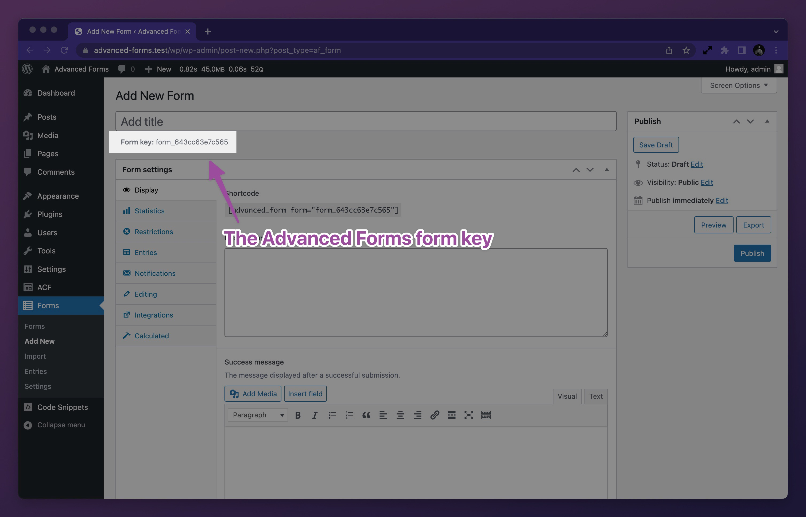
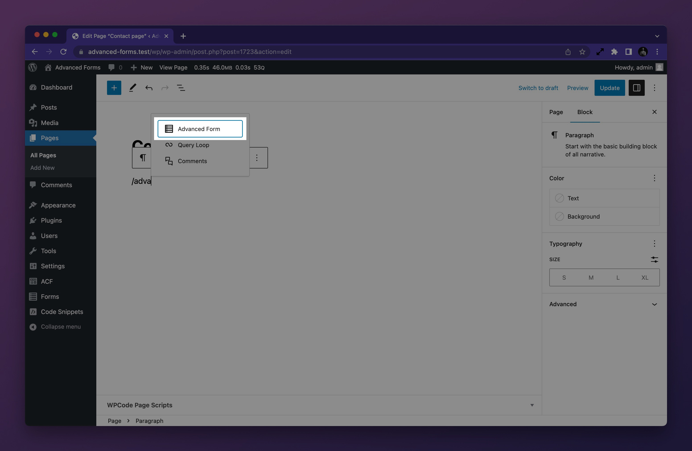
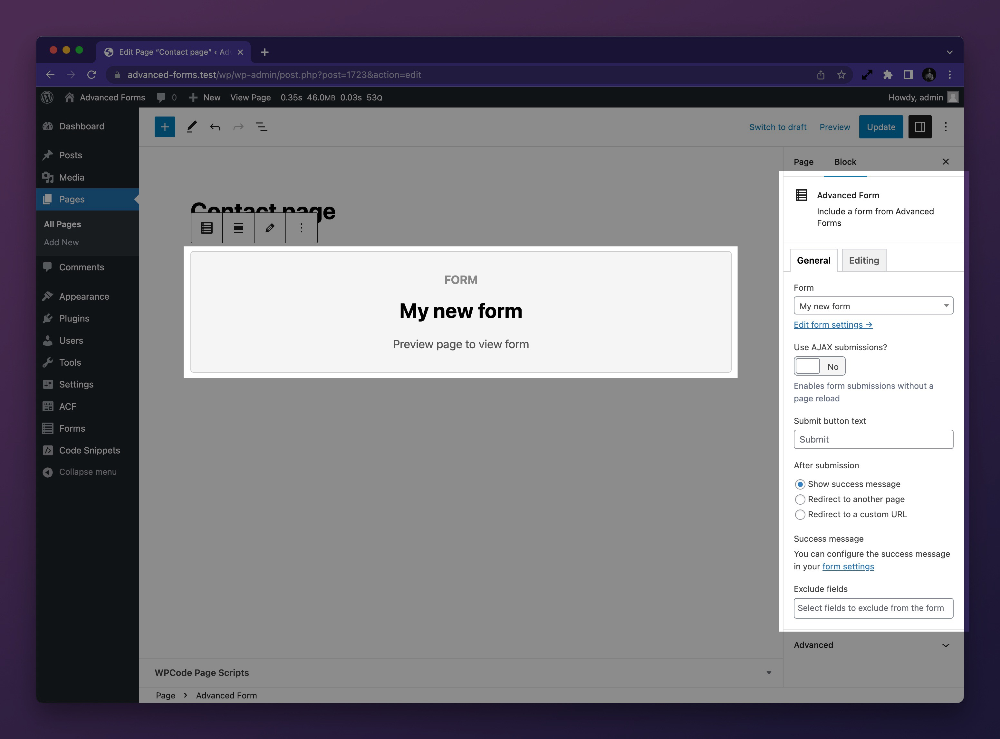

# Displaying a form

Displaying a form can be done in a number of ways:

1. **Using the `[[advanced_form]]` shortcode.**<br>This option offers a good balance of flexibility in that it can be used
   anywhere a shortcode can be rendered whilst allowing you to pass in display arguments to control the form's
   behaviour.
2. **Using the _Advanced Form_ block**<br>This option makes it possible to render a form using the WordPress block
   editor and has some configurable settings available on the block settings panel. The settings don't represent all
   available display arguments so this isn't as flexible as using a shortcode.
3. **Using the `advanced_form()` function**<br>This option is the most flexible as it is used within PHP and accepts
   display arguments as an array which can dynamically be generated and modified to suit any situation.

## Getting the form key

Both the `[[advanced_form]]` shortcode and the `advanced_form()` function require a form key to be passed in so the plugin
knows which form to render. The form key can be found in the form's edit screen directly below the form title:



## Using the _Advanced Form_ block

When using the block editor to build your content, you may use the _Advanced Form_ block to render a form. Simple start
by typing `/` to bring up the block editor's inserter and then type `advanced form` to find the block:



Clicking on the block will insert it into your content and you will be presented with a settings panel where you can
select the desired form and configure some of the common settings for the ACF form:



If you need control of more advanced settings, you may choose to use the `[[advanced_form]]` shortcode instead via
WordPress' shortcode block. Alternatively, you
may [filter the display arguments using PHP](Display-arguments.md#filtering-display-arguments).

## Using the `[[advanced_form]]` shortcode

When using the block editor or a tool such as a page builder, you may use the `[[advanced_form]]` shortcode to render a
form. The shortcode requires a form key to be passed in order to understand which form to render. The most basic
implementation of the shortcode is as follows:

`[[advanced_form form="form_62bd15508b9c9"]]`

This will render the form with the key `form_62bd15508b9c9` and use the default display arguments. You may pass in
optional display arguments to further control the form's display and behaviour. e.g;

`[[advanced_form form="form_62bd15508b9c9" ajax="1" display_title="1" redirect="https://example.com"]]`

For a full list of available display arguments, please see the [_Display arguments_](Display-arguments.md) page.

## Using the `advanced_form()` function

You may use the `advanced_form()` function to display a form using PHP. It requires a form key passed in as the first
parameter and supports an optional second parameter for passing in an array of display arguments. A simple example of
rendering a form is as follows:

```php
advanced_form( 'form_62bd15508b9c9' );
```

To pass additional display arguments, you can pass in an array as the second parameter:

```php
advanced_form( 'form_62bd15508b9c9', [
	'ajax' => true,
	'display_title' => true,
	...
] );
```

For a full list of available display arguments, please see the [_Display arguments_](Display-arguments.md) page.

### Assigning the form markup to a variable

If you wish to assign the form markup to a variable, you may do so by setting the `echo` display argument to `false`:

```php
$form = advanced_form( 'form_62bd15508b9c9', [ 'echo' => false ] );
```

