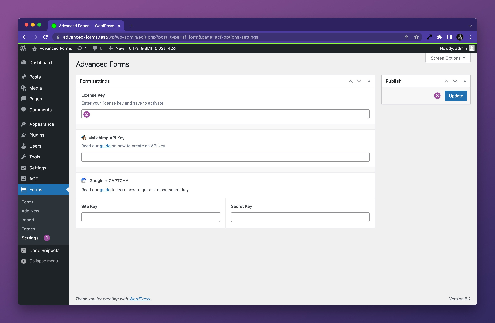

# Installing and activating the plugin

1. Download the plugin zip file from either
   the [WordPress plugin directory](https://wordpress.org/plugins/advanced-forms/) (free version) or
   your [Hookturn account page](hthttps://hookturn.io/account) (PRO version).
2. Head to the **plugins** area of your website – **WP Admin > Plugins > Add New** – and upload the file.
3. Activate the plugin.

## Activating the license

If using the pro version of the plugin, in order to receive new features, bugfixes, and support, you must activate the
license key on the site. To do this;

1. Head to the plugin settings page – **WP Admin > Forms > Settings**.
2. Enter your license key.
3. Click the **Activate License** button.

