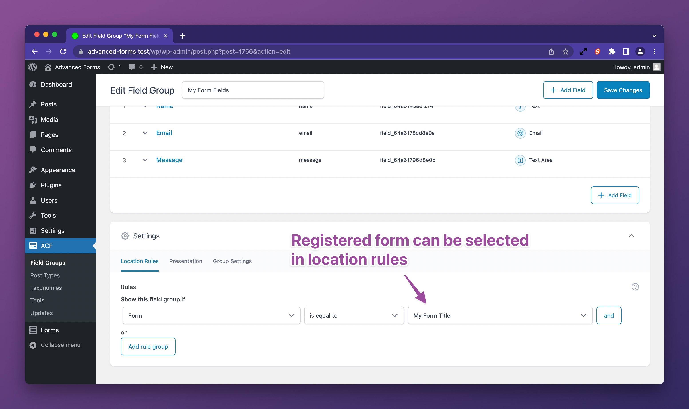

# Registering forms programmatically

You may choose to register your forms programmatically rather than using the admin interface. This is useful if you want
to create forms dynamically, or if you want to embed forms into the project via a theme or plugin. Doing so also
provides the benefit of being able to version control your forms.

To create a form programmatically, use the `af_register_form( $form )` function. It’s recommended to register your forms
on the `af/register_forms` hook to ensure that both Advanced Forms and ACF are installed and ready. Here’s an example:

```php
add_action( 'af/register_forms', function () {
	$unique_form_key = 'your_unique_key_here';

	af_register_form( [
		'title' => 'My Form Title',
		'key' => 'form_' . $unique_form_key,
		...
	] );
} );
```

## Supported form attributes

The `key` attribute is required, must being with `form_` and must be unique.

The `title` attribute, whilst optional, is recommended as it is used in the admin interface to select the form in ACF's
field group location rules.

For a complete example of a form array, we recommend using the form export feature.
See [Exporting from the UI to PHP](#exporting-from-the-ui-to-php).

## Exporting from the UI to PHP

You can use the UI to create a form then export the complete form registration code by clicking the **Export** button in
the **Publish** box on the form's edit screen. This serves as a great shortcut to get started with PHP form
registration.

If you choose to register the form using PHP, be sure to delete the form from the UI after exporting it to avoid
conflicts.

## Adding fields to a form

Adding fields to a PHP-registered form is the same as any other form. You can select the form in an ACF field group's
location rules:



### Programmatically adding fields to a form

If you are adding ACF field groups programmatically using
the [acf_add_local_field_group()](https://www.advancedcustomfields.com/resources/register-fields-via-php/) ACF function,
then you need to set your ACF location rule to match your registered form. Adding your form as a location rule is simple
and can be done as follows:

```php
acf_add_local_field_group( [
	'key' => '',
	'title' => 'My Field Group',
	'fields' => […],
	'location' => [
		[
			[
				'param' => 'af_form',
				'operator' => '==',
				'value' => YOUR_FORM_KEY_HERE,
			]
		],
	],
	…
] );
```

