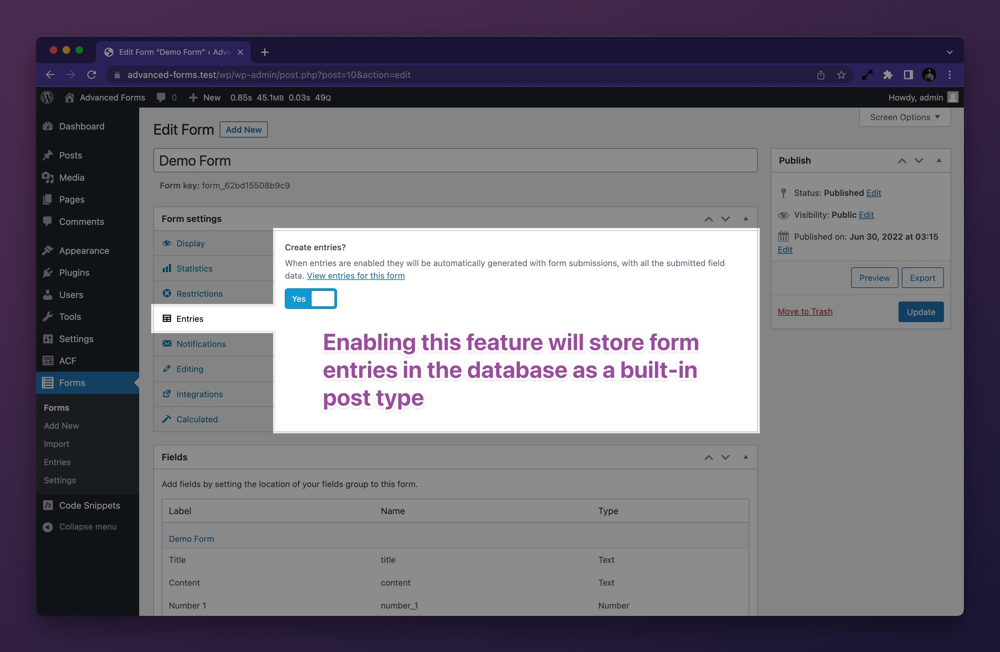
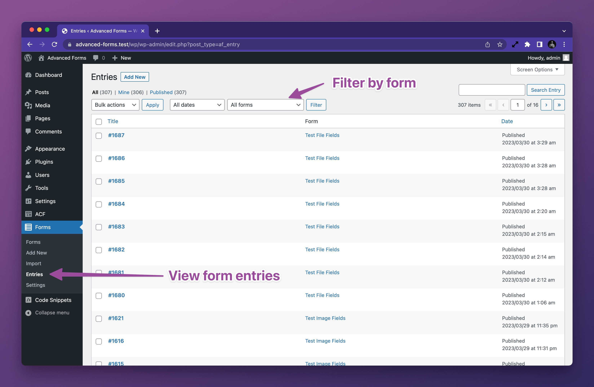
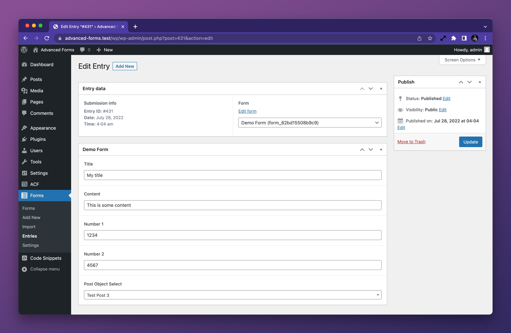

## Working with form entries

Form entries are a built-in system comprising of the `af_entry` custom post type. By default, forms do not create entry
posts but each form can have entries enabled in the form settings. When entries are enabled, each submission with create
a new entry post and the entry post will have the form fields dynamically mapped to the post — there is no need to
configure field groups to render on the entry post type.

## Are custom post types a better choice?

Note that the entry post type is not intended to be used as a content type for front end rendering and all forms
configured to create entries will save their entries to the same post type. If you wish to use Advanced Forms to create
posts of different types for front end rendering, you may prefer to use the post editing feature in Advanced Forms Pro.
This feature makes it possible to:

1. Choose which post type to create on form submission.
2. Choose which fields to map to the post.
3. Choose a post status for newly created posts.
4. Configure a form to edit existing posts.

## Enabling entries

To enable entries for a form, navigate to the **Entries** tab in the **Form settings** metabox and toggle the **Create
Entries?** setting to **Yes**:

## Where are entries stored?

All entries are stored in the `af_entry` custom post type which is accessible from the WordPress admin menu:

## Editing entries

Each entry can be viewed and edited from the WordPress admin. To edit an entry, navigate to the **Entries** item in the
Advanced Forms menu and click on the entry title. This will open the entry in the WordPress editor and all field groups
that are mapped to the entry post type will be displayed. From here, you can edit the form entry as needed:

Note that if email notifications or third party integrations have been configured for the form, these will not be
updated when the entry is edited.

## Exporting entries

At present, there is no built in mechanism for exporting form entries. However, given they are a standard post type and
all field values are ACF fields stored against the post, you should be able to use any decent WordPress export plugin to
export form entries.

## Related links

- [Customizing form entries](Customizing-form-entries.md)
- [How to display form entries](How-to-display-form-entries.md)